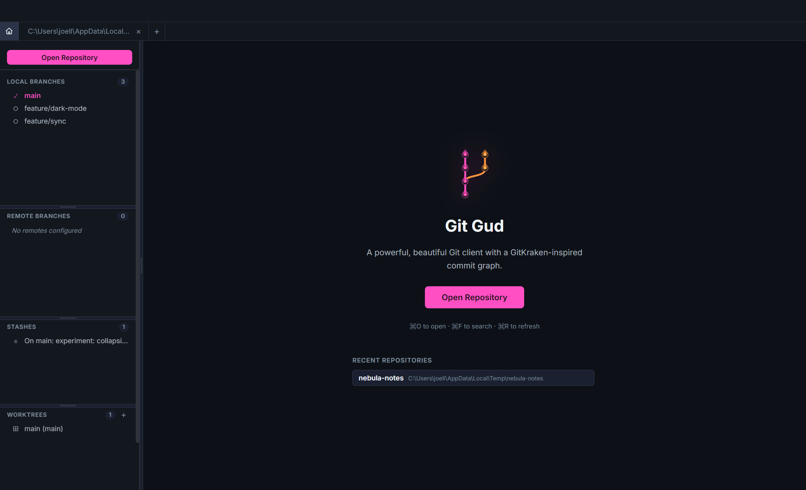
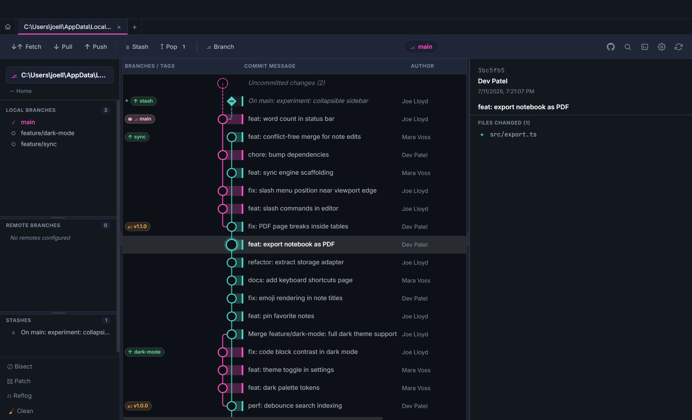
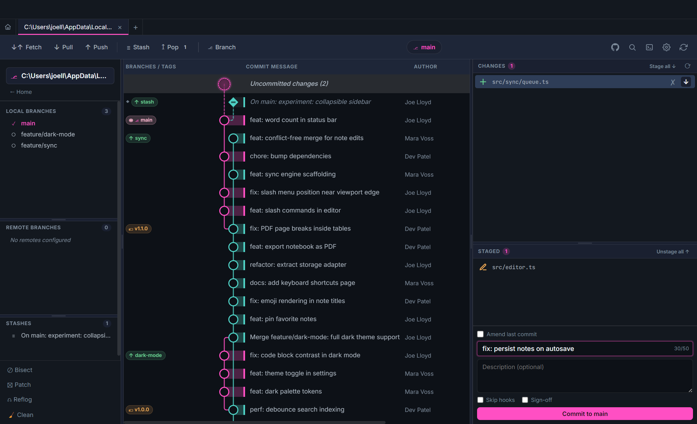
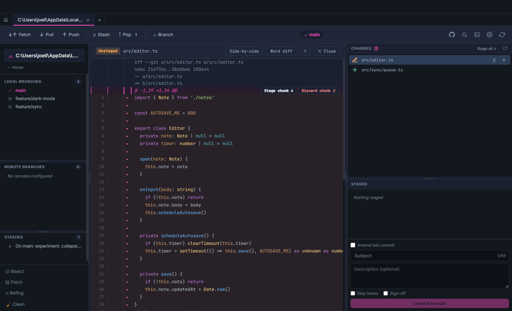
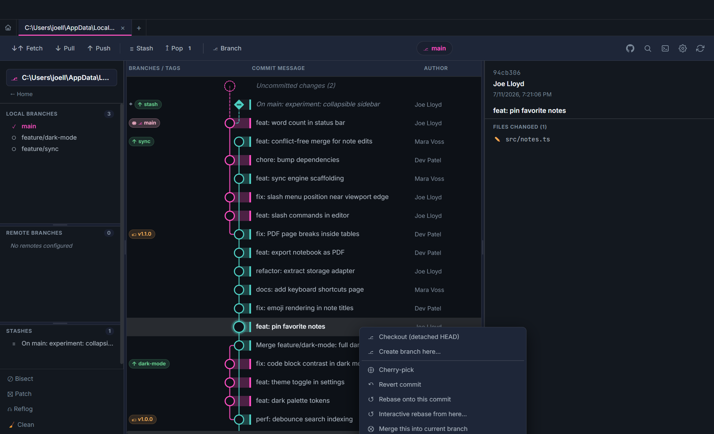

# Git Gud — User Guide

Everything you can do in the app, in the order you'll meet it. For the exact
git-command-by-command support matrix, see [Git feature coverage](git-features.md).

> **Keyboard note:** shortcuts are written Mac-style (`⌘`). On Windows/Linux use `Ctrl`.

## Contents

- [Getting started](#getting-started)
- [Reading the commit graph](#reading-the-commit-graph)
- [Selecting commits](#selecting-commits)
- [Search](#search)
- [Staging and committing](#staging-and-committing)
- [The diff viewer](#the-diff-viewer)
- [Branches, tags, and stashes](#branches-tags-and-stashes)
- [Drag a branch onto another](#drag-a-branch-onto-another)
- [Rewriting history](#rewriting-history)
- [Remotes and host sign-in](#remotes-and-host-sign-in)
- [Merge conflicts](#merge-conflicts)
- [Recovery and maintenance](#recovery-and-maintenance)
- [The console dock](#the-console-dock)
- [Settings](#settings)
- [Peer connections](#peer-connections)
- [Keyboard shortcuts](#keyboard-shortcuts)

## Getting started

- **Open Repository** (or `⌘O`) opens a folder picker; pick any directory that
  contains a git repo.
- Recently opened repos are listed on the start page — one click reopens them.
- Each repo opens in a **tab**, so you can work across several repos at once.
  The **home** button (top-left) returns to the start page without closing tabs;
  your open tabs are restored on the next launch.

## Reading the commit graph

The main view is the commit graph: every branch, drawn as colored lanes.

- **Ring nodes** are commits. **Diamond nodes** are stashes. The **dashed hollow
  node** pinned above HEAD appears when your working tree is dirty and shows the
  change count ("Uncommitted changes (2)").
- **Pills in the left column** are refs on that commit — local branch `⎇`,
  remote branch `↑`, current HEAD `◉`, tag `🏷`, checked out in a worktree `⊞`.
  When a commit carries several refs they collapse into one pill plus a `+N`
  chip; hover it to see them all. Hover any pill for its full ref names.
- Columns: refs · graph · commit message · author · date · SHA. The panel on
  the right shows the selected commit's details and changed files; click a file
  to see its diff.

## Selecting commits

- **Click** a commit to select it.
- **Shift-click** selects a contiguous range from the previous selection.
- **⌘/Ctrl-click** toggles individual commits in and out of the selection.
- Multi-selections unlock bulk actions (squash, drop, cherry-pick, revert) via
  right-click — see [Rewriting history](#rewriting-history).

## Search

`⌘F` opens the search bar. Besides message / author / SHA matching, the
**Content** mode runs a pickaxe search (`git log -S`) to find commits whose
diff adds or removes a given string.

## Staging and committing

Select the **Uncommitted changes** node (or just look at the right panel while
the tree is dirty):

- **Changes** lists unstaged and untracked files; **Staged** is below it. The
  `↓` button on a row stages the file; **Stage all ↓** does the lot. `↑`
  unstages. The `✕` discards a file's changes (two-step confirm — untracked
  files are deleted from disk).
- Arrow keys move through the file list, `Enter` opens the diff.
- The commit box takes a **subject** (soft 50-char guide) and an optional
  description. Toggles: **Amend last commit**, **Skip hooks** (`--no-verify`),
  **Sign-off** (`--signed-off-by`).

## The diff viewer

Click any changed file (working tree or in a commit) to open the diff.

- **Stage chunk ↓ / Discard chunk ✕** per hunk (`git add -p` equivalent —
  discard is a two-step confirm).
- Click a line's `+`/`−` sign to stage **just that line**; Alt-click works too.
- **Word diff** highlights intra-line changes; **Side-by-side** splits old/new.
- Keyboard: `j`/`k` next/previous hunk, `s` stage hunk, `⇧S` stage file,
  `d` discard hunk, `?` shows the full shortcut overlay.

## Branches, tags, and stashes

- **Create a branch** from the toolbar **Branch** button, or right-click any
  commit → **Create branch here…**
- **Checkout** by double-clicking a branch in the sidebar (or right-click →
  checkout). Right-click also offers **rename** and **delete**.
- **Tags**: right-click a commit → **Tag here** creates an annotated tag. The
  sidebar Tags section lists every tag; right-click one to **push it to the
  remote**, **delete it locally**, **delete it from the remote**, copy its
  name, or branch from it.
- **Stashes**: the toolbar **Stash** button saves one; **Pop** re-applies the
  most recent. The sidebar Stashes section supports apply / drop / **create
  branch from stash**. Stashes appear in the graph as diamond nodes with dashed
  connectors.
- **Worktrees**: the sidebar Worktrees section lists them; **+ Manage** adds
  one (new branch checked out in a separate folder), right-click removes.

## Drag a branch onto another

Drag any branch pill in the graph (or sidebar) and drop it onto another branch.
A menu opens with the sensible combinations — merge it into the target, rebase
onto it, or check out — so you never have to remember argument order.

## Rewriting history

Right-click a commit:

- **Checkout (detached HEAD)** / **Create branch here…**
- **Cherry-pick** and **Revert commit** (both work on multi-selections too)
- **Rebase onto this commit** and **Interactive rebase from here…** — the
  interactive wizard lets you reorder, reword, squash, and drop commits
- **Merge this into current branch**
- **Reset --hard** to a commit (two-step confirm)
- With a **contiguous multi-selection**: squash the range into one commit, or
  drop it entirely

## Remotes and host sign-in

- Toolbar **Fetch / Pull / Push** do what they say; ahead/behind counts show on
  the current-branch pill. The **▾** next to Push (or right-clicking Push)
  offers **Force push** — it uses `--force-with-lease`, so it refuses to
  overwrite commits you haven't fetched yet.
- The **Integrations panel** (GitHub icon in the toolbar) signs the app into
  **GitHub** (device flow — no setup needed), **GitLab** (personal access
  token, self-hosted supported), and **Bitbucket** (app password). While
  signed in, push/pull/fetch against that host authenticate automatically, and
  you can create a remote repository for the current repo from inside the app.
- Tokens are stored encrypted on-device (Electron `safeStorage`).

## Merge conflicts

When a merge, rebase, cherry-pick, revert or stash re-apply stops on
conflicts, the right panel takes over and lists the conflicted files. The
top bar names the paused operation; the panel offers continue, skip (where
git allows it) and abort for that operation. Aborting a conflicted stash
re-apply restores the conflicted files from HEAD and keeps the stash entry.

Click a file to open the **conflict editor**:

- **Current** and **Incoming** panes show the whole file. Inside a conflict
  block, lines both sides share are tinted lightly; lines that differ are
  tinted strongly and the changed words are marked, so you see exactly what
  changed. Click any line to insert it at the cursor in the result.
- Each block has a header with **Use this** / **Use both**; the toolbar has
  the same for the active block plus prev/next navigation. **Take all
  current / incoming** replaces the whole result.
- The **Resolved** pane is syntax-highlighted and editable. Its gutter tag
  says where each line came from: **C** current, **I** incoming, **B**
  identical on both sides, **E** hand-edited, **!** leftover conflict marker.
  The legend in the toolbar counts them.
- **Save & Mark Resolved** writes the file and stages it. Saving with
  markers still present asks first.

Enable **rerere** in Settings and git will remember your resolutions and
auto-apply them next time (a banner shows when it did, with a **Forget**
escape hatch).

## Auto-fix for blocked actions

When git refuses a pull, checkout, merge, cherry-pick or revert because of
your working tree, Git Gud clears the blocker itself instead of showing a
"you can't do that" popup:

- **Uncommitted changes would be overwritten** → stash, retry, re-apply.
- **Untracked files would be overwritten** → set aside exactly those files
  (a stash with `--include-untracked` limited to them), retry, re-apply.
- **Checkout** keeps the stash instead of re-applying it onto the new branch
  (that is exactly what git refused); the toast offers **Pop stash now**.
- If re-applying conflicts, the stash is kept and the conflict panel opens
  for the re-apply. Nothing is ever dropped.
- A rejected **push** offers **Pull now** on the toast.

Every auto-fixed action shows a toast listing the steps that ran
(“1. Stashed 2 changed files · 2. Pull succeeded · 3. Re-applied your
changes”). Turn it off in Settings › **Auto-fix blocked actions** to get the
old confirm prompts instead. A diverged branch still asks merge vs rebase —
that decision is yours.

### Trying the flows

`pnpm lab` builds one throwaway repo per scenario under
`~/Projects/MyProjects/git-gui-test-repos/conflict-lab/` (mid-merge, mid-rebase,
cherry-pick, revert, conflicted stash pop, dirty pull, untracked pull,
diverged, dirty checkout, dirty merge, dirty cherry-pick, rejected push).
`pnpm lab -- --list` lists them; `pnpm lab merge` rebuilds one.

## Recovery and maintenance

All in the bottom-left advanced bar:

- **Bisect** — guided good/bad binary search to find the commit that broke
  something.
- **Patch** — export commits with `format-patch`, apply patch files with
  `am` / `apply`.
- **Reflog** — browse where HEAD has been and restore to any entry (the safety
  net after a bad reset).
- **Clean** — delete untracked/ignored files with scope toggles and a
  type-to-confirm guard.

## The console dock

The bottom dock (toggle it from the toolbar) has two halves:

- **Console** — a real shell prompt at the worktree root, for anything the UI
  doesn't cover.
- **Git Activity** — a live log of every git command the app runs, with output
  and exit status. Great for learning what a button actually does, or for
  copying a command. **Changes only** hides read-only queries.

## Settings

The gear icon opens Settings: UI zoom / text scaling, a high-contrast theme
toggle, and the rerere switch.

## Peer connections

Git Gud can drive another machine's repositories. The other side is a
*host* — a second Git Gud with **Settings → Share with other Git Gud
instances** switched on, or a [`gitgud-headless`](headless.md) daemon on a
Linux box — and every git command runs *there*: your GUI just renders the
result and streams the host's working tree live (SSE), so staging, committing,
fetch/pull/push, rebase and the rest all behave like a local repo.

**Pairing.** Open **Peers** in the sidebar. Hosts on your LAN appear under
*Nearby*; anything else goes through **Connect by address…** (hostname, IP,
Tailscale MagicDNS name, or a pasted pairing payload from *Show QR* /
`gitgud-headless pair --qr`). Compare the certificate fingerprint both sides
show, type the host's 6-digit code, done — the host's self-signed certificate is
pinned from then on, and a changed certificate is flagged instead of trusted.

**Reach.** Same network works out of the box (UDP discovery on 47832, HTTPS on
47831). Across buildings, install Tailscale on both machines and connect by the
tailnet name — nothing else to configure. Without Tailscale, point both sides at
a [relay](relay.md) you host; it only forwards ciphertext.

**Trust controls** (per host, Settings → Share…): a global **Read-only**
switch; per paired device a read-only tick plus *scopes* — writes a read-only
device may still run (fetch, pull) with tap-to-approve on the phone; **Forget**
/ **Revoke** on either side; tokens expire and rotate automatically. Each row
shows the device kind (desktop, daemon, phone), transport (LAN / ts / ssh /
relay) and round-trip time.

**Phone.** The read-only [companion app](companion.md) pairs the same way by
scanning the host's QR and can get a push notification when a repo changes
(**Notify phones on changes**).

## Keyboard shortcuts

| Keys | Where | Action |
| --- | --- | --- |
| `⌘O` | anywhere | Open repository |
| `⌘F` | anywhere | Search commits |
| `⌘R` | anywhere | Refresh repo state |
| `Esc` | anywhere | Close search / modal / menu |
| `Shift`-click | graph | Select contiguous range |
| `⌘`-click | graph | Toggle commit in selection |
| `↑` `↓` `Home` `End` | file list | Move through files |
| `Enter` | file list | Open diff |
| `j` / `k` | diff | Next / previous hunk |
| `s` / `⇧S` | diff | Stage hunk / whole file |
| `d` | diff | Discard hunk |
| `?` | diff | Show all diff shortcuts |
